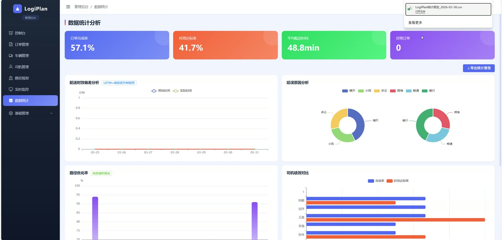
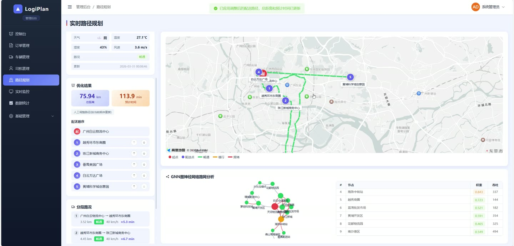
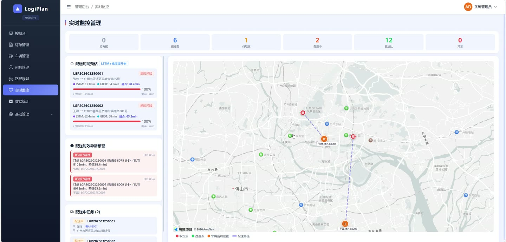
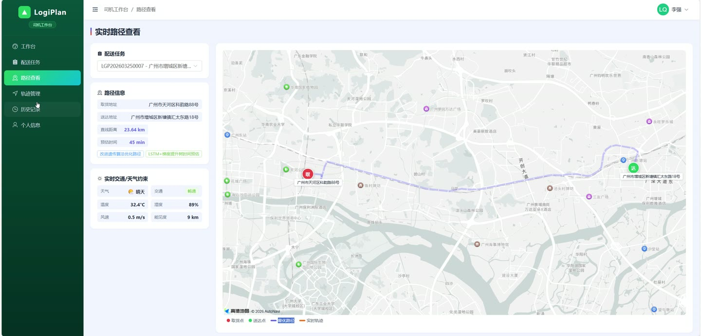
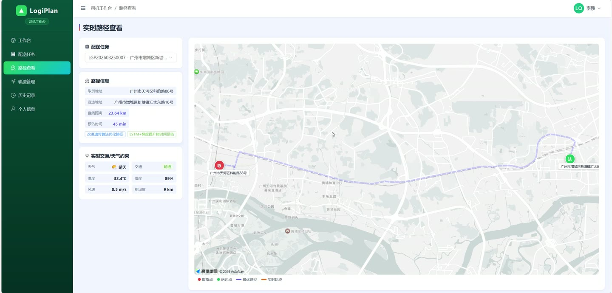

# (附文档)Python+深度学习+TensorFlow 智能物流路径规划与配送时间预估系统

**技术栈**：Python、Flask、TensorFlow、深度学习、Vue3、MySQL

### 系统简介

本系统是一套基于 Python + TensorFlow 深度学习与 Vue3 前后端分离架构的智能物流路径规划与配送时间预估平台，围绕订单、车辆、司机、商户、客户、配送任务与轨迹构建完整业务闭环。系统内置改进遗传算法路径优化、LSTM+梯度提升树组合模型时间预估与 GNN 路网分析能力，分为管理员端与司机端两类角色，前台首页公开访问。
 
### 核心功能
 
### 管理员端

 
- 控制台总览：展示今日订单、累计订单、配送中订单、待分配订单、完成率、时效达标率与平均配送时效等核心指标卡片。 
- 时效趋势图表：以折线+柱状组合图展示预估时间、实际时间与偏差，支持按天维度查看配送时效走势。 
- 订单状态分布：以环形饼图统计待分配、已分配、待取货、配送中、已送达、异常各状态订单占比。 
- 路径优化率图表：双轴展示每日路径优化率与总距离，评估改进遗传算法优化效果。 
- 司机绩效排名：横向条形图对比各司机的完成率与时效达标率。 
- 订单管理：按订单号/货物/地址关键字、订单状态、优先级筛选订单，支持分页浏览与重置查询。 
- 创建与编辑订单：选择商户与客户自动带出地址，录入货物名称、重量、体积、优先级、距离、时间窗、天气与交通状况。 
- AI 时间预估：点击 AI 预估按钮调用组合模型，结合距离、重量、天气、交通等特征自动填充预估配送时间。 
- 订单分配：为待分配订单选择司机与车辆，生成配送任务。 
- 批量分配：勾选多个待分配订单后统一指定司机与车辆，一次性完成批量派单。 
- 订单详情查看：以描述列表展示订单编号、状态、商户、客户、取送货地址、货物信息、预估与实际时间、时间窗、距离、天气交通等完整字段。 
- 订单删除：对指定订单执行删除操作并刷新列表。 
- 车辆管理：维护车牌号、车辆类型、最大载重、最大体积、绑定司机、车辆状态与当前位置经纬度。 
- 司机管理：新增/编辑司机账号，设置用户名、姓名、手机号、邮箱与启用状态，支持重置密码为默认值。 
- 路径规划：调用路径规划接口，基于改进遗传算法融合载重、时效与路网约束输出优化路径。 
- 实时监控：顶部进度条展示各状态任务数量，左侧展示配送时间预估、异常预警与配送中任务列表，右侧高德地图渲染取货点、送达点、车辆位置与配送路径线。 
- 时间预估面板：逐单展示 LSTM 预测值、GBDT 预测值与融合预测值，并以进度条显示已用与剩余时间，超时订单标红。 
- 异常预警：按 danger/warning/info 分级展示配送时效异常信息，含司机、订单号与发生时间。 
- 数据统计：提供总览、配送时效、订单状态、路径优化、司机绩效等多维度统计接口数据。 
- 商户管理：维护商户名称、联系人、联系电话、地址与经纬度，支持地址搜索选点与启用禁用状态。 
- 客户管理：维护客户名称、电话、收货地址与经纬度，支持关键字搜索与地址选点。 
- 系统日志：按操作模块、操作用户、操作状态筛选日志，展示请求方法、URL、IP、耗时与成功失败状态。 
- 个人信息：查看与维护当前管理员账号的头像、姓名、手机号与邮箱。
 
### 司机端

 
- 工作台：展示司机个人待办任务与配送概况数据。 
- 配送任务：查看分配给自己的配送任务列表，按状态跟踪任务进度。 
- 任务状态流转：支持接单、取货、送达等节点操作，记录接单时间、取货时间与送达时间。 
- 路径查看：查看订单对应的规划路径与路线数据，辅助按最优路线行驶。 
- 轨迹管理：上报配送过程中的经纬度、速度与方向，形成配送轨迹记录。 
- 历史记录：查询本人已完成的历史配送任务与轨迹信息。 
- 个人信息：查看与维护司机账号的头像、姓名、手机号与邮箱。
 
### 前台首页

 
- 公开访问：无需登录即可浏览系统首页，展示平台品牌与核心能力介绍。 
- 登录入口：提供用户名密码登录，支持管理员、司机账号快捷填充，登录后按角色跳转对应后台。
 
### 技术栈

 后端框架Python + Flask ORMFlask-SQLAlchemy 权限认证Flask-JWT-Extended + 路由角色守卫 深度学习TensorFlow（LSTM 时间预估、GNN 路网分析、改进遗传算法路径优化） 前端框架Vue3 + Element Plus 状态管理Pinia（user store） 路由与构建Vue Router + Vite 可视化ECharts + 高德地图 JS API 数据库MySQL
 
### 交付内容

 
- 后端完整源码 
- 前端完整源码 
- 数据库初始化脚本 
- 万字文档

## 界面展示

---

## 获取完整源码 + 万字文档

本仓库为项目介绍页。**完整前后端源码、数据库初始化脚本、万字项目文档**，请加微信 `kangkangcode`，或访问 [codekk.top](http://codekk.top) 获取。

可作课程设计 / 毕业设计参考，支持远程部署调试。